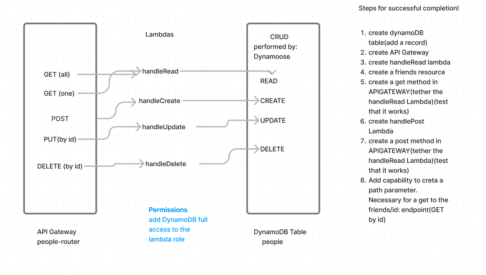

# LAB - Class 18

## Project: serverless-api

### Author:  Malik Sadiki-Torres

### Problem Domain

What is the root URL to your API?

The root URL is people

What are the routes?

`GET`
`GET/id`
`POST`
`PUT/id`
`DELETE/id`

What inputs do they require?

THey require an ID and a body object

They require the id routes

What output do they return?

### Links and Resources

### Collaborators
I referenced the demo video and the lecture md

### Setup

#### How to initialize/run your application (where applicable)

#### Routes

#### Tests

#### UML

